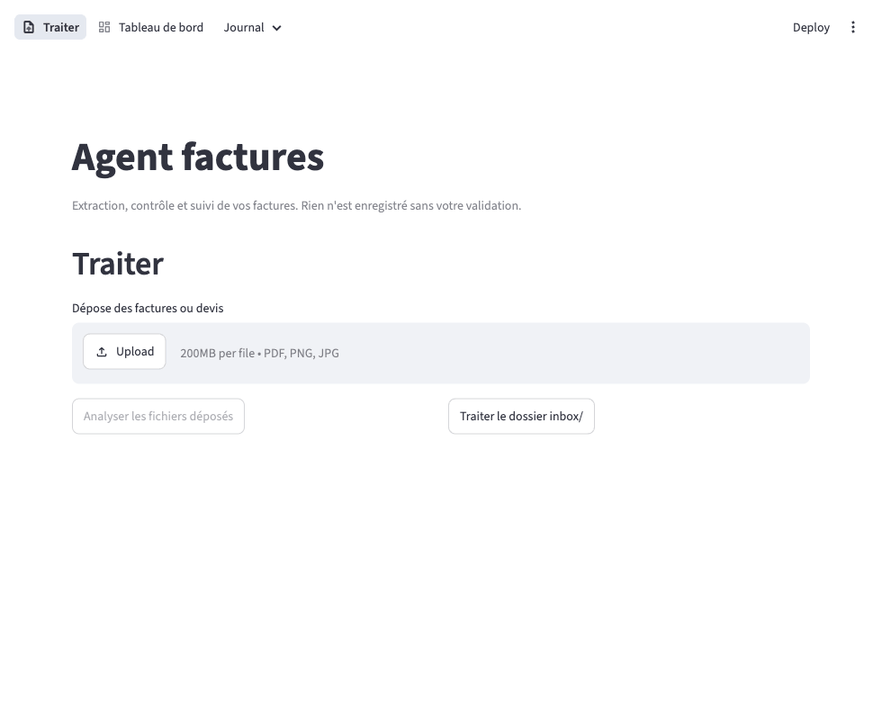

# Agent factures

**Un agent IA qui lit vos factures, en extrait les données, repère les erreurs et prépare les relances clients, sous votre contrôle.**

Dans une PME, saisir et vérifier les factures prend plusieurs heures par semaine : recopier les montants, repérer les doublons, surveiller ce qu'il reste à payer aux fournisseurs et à encaisser auprès des clients. Cet agent fait le travail préparatoire, et un humain valide chaque pièce en quelques secondes.



*En 30 secondes : l'agent analyse une facture et repère une TVA incohérente. Au rejet, il prépare la demande de facture rectificative. Le journal classe ensuite les factures par statut de paiement, avec les relances clients prêtes à envoyer.*

## Ce que fait l'agent

1. **Lit** les factures et devis en PDF ou en image (y compris des scans).
2. **Extrait** l'émetteur, le destinataire, le sens (facture reçue d'un fournisseur ou émise vers un client), le numéro, les dates, les montants HT, TVA et TTC, et les lignes de détail.
3. **Vérifie** la cohérence des montants, les doublons, les montants inhabituels pour un fournisseur et les échéances dépassées.
4. **Explique** son verdict en langage clair : ✅ OK, ⚠️ anomalie ou ❓ à revoir.
5. **Attend votre validation** avant d'enregistrer quoi que ce soit.
6. **Prépare les mails** : une relance pour chaque client en retard de paiement, et une demande de facture rectificative quand tu rejettes une facture fournisseur à cause d'une erreur de montant. Rien n'est jamais envoyé automatiquement.
7. **Suit les paiements** : le menu Journal donne accès à cinq pages (à payer, échéance dépassée, clients impayés, payées, historique), avec un bouton pour marquer une facture comme payée ou annuler ce paiement.

## Résultats mesurés

Évaluation de Claude Sonnet 5 sur **40 documents fictifs** : factures reçues et émises, devis, 3 scans dont un dégradé (penché, flou, taché), une facture de 2 pages, plusieurs taux de TVA, factures en anglais avec autoliquidation, mises en page variées, et des pièges volontaires (3 doublons dont un au numéro formaté autrement, 3 erreurs de TVA, des lignes mal additionnées, 2 montants inhabituels, 5 échéances dépassées). S'y ajoutent un avoir, un bon de livraison et un courrier, que l'agent doit écarter.

| Métrique | Résultat |
|---|---|
| Précision des champs extraits (10 champs × 37 pièces) | 100 % |
| Anomalies détectées (rappel) | 100 % (14/14) |
| Fausses alertes (précision) | 100 % (aucune) |
| Verdicts corrects | 100 % (40/40) |
| Coût moyen par document | 0,033 $ |
| Temps moyen par document | 11,4 s |

Les documents sont générés par code : ils sont propres et lisibles, contrairement à une partie des vraies factures. Ces scores montrent que le pipeline est correct de bout en bout. Ils ne garantissent pas le même niveau sur des documents réels très abîmés, qui sont la prochaine étape d'évaluation.

Détail par document : `evals/results/claude-sonnet-5.json`. Pour reproduire (environ 1,30 $) : `uv run python -m evals.run --model claude-sonnet-5 --max-cost 2`.

## Démarrage rapide

```bash
git clone https://github.com/micouaidan55/agent-factures.git && cd agent-factures
cp .env.example .env        # puis renseigner ANTHROPIC_API_KEY (et COMPANY_NAME, le nom de votre entreprise)
uv sync
uv run streamlit run app/main.py
```

Des documents d'exemple se trouvent dans `evals/dataset/` : déposez-les dans l'interface ou copiez-les dans `inbox/`.

## Architecture

```
PDF / image ──► InvoiceAgent (boucle agentique) ──► verdict + extraction ──► validation humaine ──► SQLite
                     │  ▲
         tool_use    ▼  │  tool_result
                 ToolExecutor ──► check_amounts · check_due_date · find_duplicates · get_supplier_history
                                  (lecture seule)
```

| Module | Rôle |
|---|---|
| `agent_factures.extraction` | Modèles Pydantic (`Invoice`, `Verdict`, `Issue`) |
| `agent_factures.agent` | Boucle agentique écrite à la main sur l'API Messages de Claude, exécuteur d'outils, chargement des documents |
| `agent_factures.tools` | Vérifications déterministes et brouillon de relance |
| `agent_factures.storage` | SQLite, journal d'actions, exports CSV et Excel |
| `agent_factures.web` | Éléments d'interface Streamlit partagés |
| `app/` | Point d'entrée et pages Streamlit (navigation en haut de page) |
| `evals/` | Génération du jeu de test et mesure de la précision |

### Choix de conception

- **Boucle agentique manuelle plutôt qu'un framework** : environ 140 lignes lisibles, avec un contrôle total des garde-fous.
- **L'agent ne peut rien écrire** : il ne dispose que d'outils en lecture seule. L'enregistrement est une action humaine.
- **Contrôles déterministes en code, jugement par le LLM** : les calculs (TVA, doublons, seuils) sont faits par du code testé. Claude décide quoi vérifier et explique le résultat. Un verdict « OK » est automatiquement requalifié si un contrôle a détecté un problème. Le code garantit aussi l'exécution des quatre contrôles (montants, échéance, doublons, historique fournisseur) même si le modèle en oublie un : ceux qui manquent sont relancés avant le verdict final.
- **Garde-fous** : 10 itérations maximum par document, une seule nouvelle tentative en cas d'extraction invalide, coût en tokens affiché pour chaque document.
- **Testé sans API** : la suite pytest utilise un client factice et ne consomme aucun crédit.

## Tests

```bash
uv run pytest
```

## Limites connues et feuille de route

- Pas encore de connexion à une boîte mail (Gmail ou IMAP).
- Mono-utilisateur, sans authentification.
- Prochaines étapes : tri automatique des emails entrants, relances clients, option de modèle local pour les données sensibles.
